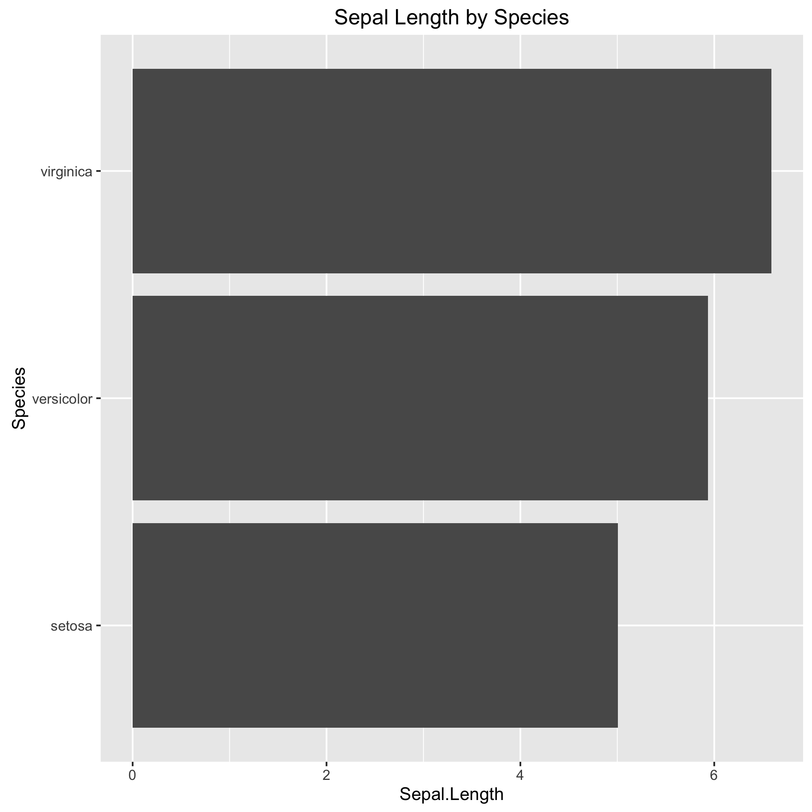
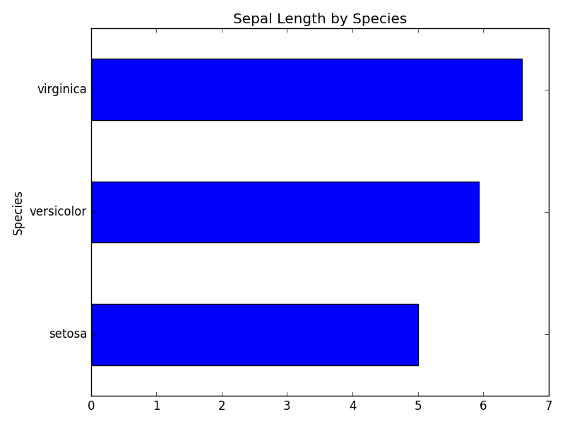

#Horizontal Bar Plots
---
#R
```r
library(dplyr)
library(magrittr)
library(ggplot2)

iris %>%
    dplyr::group_by(Species) %>%
    dplyr::summarise(Sepal.Length = mean(Sepal.Length)) %>%
    ggplot(aes(Species, Sepal.Length)) + geom_bar(stat = 'identity') + 
    coord_flip() + ggtitle('Sepal Length by Species') + 
    ggsave('r_sep_length_by_species.png')
```



#Python
```python
import numpy  as np
import pandas as pd
import matplotlib.pyplot as plt
from   sklearn import datasets

scikit_iris  = datasets.load_iris()
col_names = scikit_iris.feature_names
col_names.append('Species')
iris = pd.DataFrame(np.column_stack((scikit_iris.data, scikit_iris.target)),  
                    columns = col_names)
iris['Species'] = iris['Species'].map({
                    0: scikit_iris.target_names[0],  
                    1: scikit_iris.target_names[1],  
                    2: scikit_iris.target_names[2]  
                  })
iris.groupby(['Species'])['sepal length (cm)'].mean().plot(kind = 'barh', title = 'Sepal Length by Species')
plt.savefig('py_sep_length_by_species.png')
```



***
#### Feel Free to add more comparisons
